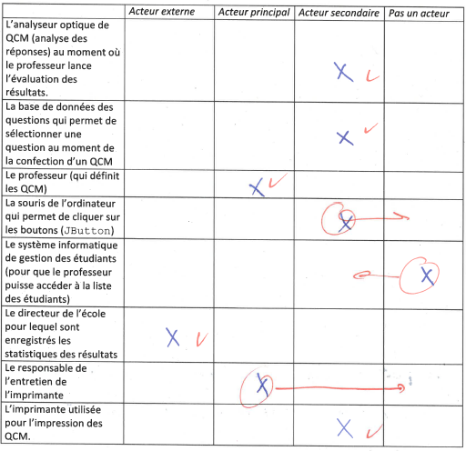

**Mandatée par le client X, notre société de développement doit se déterminer quand au cycle de vie à mettre en oeuvre dans le cadre du projet à réaliser. **

- **Ce projet ne présente pas de risque particulier. Nous avons réalisé avec succès un projet très similaire il y a deux années en arrière. Que choisirons-nous ?**
  - (Cycle de vie classique)
  - Cycle de vie en V
  - ~~Cycle de vie en spirale~~
  - ~~Cycle de vie itératif~~

**La lecture d'un modèle de domaine donne un certain nombre d'indications explicites sur la manière de concevoir l'architecture du logiciel. Notamment, des indications portées habituellement sur un modèle de domaine, on peut déduire**:

- Les interfaces potentielles que devrait implémenter telle ou telle classe
- Les variables d'instance potentielles devant être déclarées dans telles ou telles classe
- ~~Le caractère abstrait de telle ou telle classe~~
- ~~Les constructeurs à mettre en oeuvre dans telle ou telle classe~~

**Parmi les assertions suivantes, cochez celles qui reflètent correctement la méthode XP:**

- ~~Avec XP, une des toutes première itérations consiste à mettre en place l'architecture du système.~~
- ~~C'est le "manager", appuyé par le "coach", qui organise la répartition du travail entre les différents collaborateurs au sein de chaque itération.~~
- Avec XP, les spécifications détaillées sont écrites par le client lui-même. Il les exprime en écrivant les tests "de recette"(tests fonctionnels).
- Tests de recette et tests unitaires doivent être dans leur ensemble exécutés de manière automatique.
- Avec XP, seul le développeur est habilité à estimer le temps de réalisation d'un scénario

**Parmi les acteurs participant à un développement XP, dites quel est l'acteur principal qui accomplit chacune des activités énoncées ci-dessous:**

| Activités                                                 | Acteur principal    |
| --------------------------------------------------------- | ------------------- |
| Rédaction des scénarios                                   | Client              |
| Spécification des tests unitaires                         | Testeur/Développeur |
| Spécification des tests fonctionnels                      | Client              |
| Spécification du plan d'itération                         | Client              |
| Détermination de la charge de développement d'un scénario | Développeur         |

**Méthode XP : quand on écrit la spécification d'un logiciel, doit-on penser aux tests fonctionnels ?**

Oui, car lors de la réalisation des itérations, ce sont ces tests qui sont testés et lorsqu'a la fin les résultats des tests sont positifs(**COMME LE SIDA**) cela permettra de savoir qu'on a réussi l'itération

**Méthode XP : citez trois avantages de travailler en binôme**:

- Formation : un nouveau peut travailler avec un plus expérimenté
- Contrôle mutuel au fur-et-à-mesure
- Meilleure collaboration/Stratégie d'équipe(tournus réguliers)
- Personne n'est "indispensable" au projet
- Moins d'erreurs de code

**Méthode XP : Si l'équipe change(départs, nouveaux engagements), doit-on revoir la vélocité?**

- Oui, car la vélocité représente la charge de travail réalisable pour une équipe donnée, ainsi si cette équipe change, elle change aussi.
- Oui, la vélocité définit la charge de travail accomplissable par une équipe définie - elle change donc si cette équipe change
- Oui, la vélocité étant la capacité d'une équipe donnée pour la réalisation d'une itération. C'est une métrique propre à l'équipe considérée.

**Méthodes Agiles : Que signifie "Le processus de développement doit être adaptatifs" ?**

- Que le processus doit être capable de s'adapter à des changements de besoins du clients, ou de changements dans l'équipe, sans compromettre le projet
- Il s'agit de pouvoir adapter la méthode de travail pour gagner en efficacité.
- ~~adapter le développement aux différents changements~~

**Méthodes XP : le refactoring d'un fragment de code intervient à quel moment ?**

- Dès lors que le fragment de code donne statisfaction(du point de vue de ses résultats)

- Dès lors que le fragment de code est soupçonné d'un délit de YAGNI 

  [YAGNI]: https://en.wikipedia.org/wiki/You_aren%27t_gonna_need_it	"YAGNI"

- ~~Avant la spécification des tests fonctionnels correspondants~~

- ~~Dès lors que le client souhaite une amélioration de la conception du fragment de code~~

- ~~Dès lors que le client change d'avis vis à vis d'une fonctionnalité pour laquelle le fragment de code joue un certain rôle~~

**Méthodes XP et UP : Cochez les propositions qui vous paraissent vraies :**

- XP comme UP sont deux méthodes "conduites par les cas d'utilisation".
- ~~Avec XP, contrairement à UP, les scénarios(user stories) sont écrits au fur et à mesure des itérations plutôt qu'en une fois, avant de commencer le développement.~~
- ~~Au fil des itérations, modules par modules, XP comme UP complètent le code présenté au client en s'appuyant sur une architecture centrale élaborée dans l'une des première phase du développement.~~
- ~~Avec XP comme UP, il est préconisé d'écrire l'ensemble des classes métier(modèle de domaine) avant de commencer les itérations à proprement parler.~~

**Méthode XP pure: Que signifie "La méthode est pilotée par les tests" ?**

Cela signifie que le but principal est que le programme passe les tests qui ont été définis pour cette itération.

**Méthodes agiles : Parmi les assertions suivantes, cochez celles qui reflètent correctement la notion méthode agile.**

- La planification des itérations est un processus évolutif.
- L'observation de la vélocité d'une équipe de développement peut entraîner une révision de la planification des itérations.
- Contrairement à UP, les méthodes agiles préconisent de développer l'architecture centrale du logiciel non pas au début du développement mais au fur et à mesure des besoins.
- ~~On désire en premier lieu pouvoir s'adapter aux chagements concernant les besoins des utilisateurs. En revanche, le processus même de la méthode agile(étapes, gestion, outils,..) est clairement spécifié.~~
- ~~On désire obtenir un cahier des charges entièrement spécifié au terme de la phase d'analyse.~~
- ~~Contrairement à UP, les méthodes agiles préconisent un développement itératif incrémental.~~
- ~~Les méthodes agiles souhaitent que l'équipe soit constituée de programmeurs "séniors", (avec expérience), des programmeurs suffisamment "agiles", susceptibles d'écrire directement leur code de manière propre et définitive.~~

**Méthodes XP : D'après vous, les tests fonctionnels sont spécifés :**

- Au début de l'itération concernée
  - Au début *de chaque itération*(soulignée dans la correction). On peut ainsi écrire les tests unitaires que l'on exécutera régulièrement tout au long de la réalisation de l'itération. À la fin de l'itération, le succès des tests confirme la bonne implémentation (Commentaires : On en fait/spécifie aussi au tout début du développement. une fois les cas d'utilisation/use case déterminés)

**Problématique**

| Petits logiciels           | Gros logiciels           |
| -------------------------- | ------------------------ |
| Faciles à comprendre       | Difficile à comprendre   |
| Coûts faibles              | Coût énorme              |
| Développé par une personne | Développement par équipe |
| Rarement documenté         | Parfaitement documenté   |

**MVC**

```java
class Controleur {
    private Vue1 vue1;
    private Vue2 vue2;
    private Modele modele1, modele2;
    public Controleur() {
        modele1 = new Modele();
        modele2 = new Modele();
        vue2 = new Vue2();
        vue1 = new Vue1(modele1, modele1);
        modele1.addObserver (vue1);
        modele1.addObserver(vue2);
        modele2.addObserver(vue1);
        modele2.addObserver(modele1);π
    }
    public void changeVal (int val) {
    	m2.setVal(val);
    }
}

class Vue2 implements Observer {
	public void update (Observable obs, Object o) {
		System.out.println ((Modele)obs.getVal(););
	}
}

class Vue1 extends Vue2 {
	private Modele m2, m1;
	public Vue2(Modele m1, Modele m2) {
        this.m1=m1;
        this.m2=m2;
	}
	
	public void changeVal (int val) {
        m2.setVal(val);
        m1.setVal(val);
	}
}

class Modele extends Observable implements Observer {
    private int valeur;
    public void setVal (int val) {
        valeur=val;
        setChanged();
        notifyObservers();
	}

    public void update (Observable obs, Object o) {
        System.out.println ((Modele)obs.getVal(););
    }

    public int getVal() {return valeur ;}
}
```

**Observable/Observé**

```java
import java.util.Observer;
import java.util.Observable;
class Chrono {
    public static void main (String ... args) {
        ChronoView view = new ChronoView();
        Counter cents, seconds, minutes;
        minutes = new Counter (0, 60, null, view);
        seconds = new Counter (0, 60, minutes, view);
        cents = new Counter(10, 100, seconds, view);
        view.setCounters(minutes, seconds, cents);
        cents.go();
    }
}

class ChronoView implements Observer{
    private Counter[] counters;
    public ChronoView () {}
    public void setCounters(Counter ... counters){
    	this.counters= counters;
	}
    
    public void renderChronoState() {
        String txt = "";
        for (Counter cnt : counters) txt += cnt.getValue() + " ";
        System.out.println(txt);
    }
    
    public void update(Observable obs, Object arg) {
    	renderChronoState();
    }
}

class Counter implements Observer {
    private int value = 0;
    private int maxVal;
    private Counter next;
    private Observer view;
    private int pulse;
    
    class ChangedValueEventObservers extends Observable {
    	public void notifyObservers(){
    		this.setChanged(); super.notifyObservers();
    	}
	}
    
    class MaxValueReachedEventObservers extends Observable {
        public void notifyObservers(){
        	this.setChanged(); super.notifyObservers();
        }
    }
    
    private ChangedValueEventObservers changedValueEventObservers
    = new ChangedValueEventObservers();
    
    private MaxValueReachedEventObservers maxValueReachedEventObservers
    = new MaxValueReachedEventObservers();
    
    public Counter (int pulse, int maxValue,
    				Counter nextCounter, Observer view) {
    this.maxVal = maxValue;
    this.next = nextCounter;
    this.view = view;
    this.pulse = pulse;
        
    changedValueEventObservers.addObserver(view);
        
    if (nextCounter != null)
    	maxValueReachedEventObservers.addObserver(nextCounter);
    }
    public void go() {
        if (pulse > 0) {
            new Thread() {
                public void run() {
                    while(true) {
                        try {
                            Thread.sleep(pulse);
                            incrementValue();
                        }
                        catch (Exception e) {}
                    }
                }
            }.start();
        }
    }
    
    public int getValue() {return value;}
    
    public void update(Observable obs, Object arg) {
    	incrementValue();
    }
    
    public void incrementValue(){
        value = ++ value % (maxVal);
        if (value == 0)
        	maxValueReachedEventObservers.notifyObservers();
        changedValueEventObservers.notifyObservers();
    }
}
```

**La crise du logiciel des années 70 a eu pour conséquence - dans le courant des deux ou trois années qui ont suivi ce constat - d'opérer une remise en question du processus de développement logiciel et des outils utilisés. Notamment :**

- ~~L'arrêt de la programmation procédurale au profit d'une programmation orientée objet.~~
- ~~La promotion d'un cycle de vie de type itératif~~
- ~~La réduction systématique de la taille des équipes de développement~~
- La promotion de la phase d'analyse des besoins

**Dans une méthode de type UP, à quel moment et dans quelle phase doit-on prendre en compte ce que l'on appelle la "gestion des risques" ?**

On doit prendre en compte la gestion des risques dans la phase de l'élaboration, c'est à dire lorsqu'on va définir nos itérations qui à la fin de chacune permet d'avoir un résultat testé et exécutable. ==> Dans la phase d'initialisation on va également décider si on veut poursuivre le projet ou non, décision qui peut être prise en fonction des risques.

**Donner au moins deux raisons qui ont fait que le modèle du Cycle de Vie en spirale a été abandonné au profit de vie incrémental et itératif.**

- On a un résultat que tardivement dans le projet, pas de solution testée et excécutable rapidement pour le modèle Cycle de vie en spirale.
- Incrémental itératif permet une meilleure gestion des risques grâce aux courtes itérations.

**Dans le cycle en V, du point de vue des tests, on distinguait "vérification" et "validation". Du point de vue de la qualité du logiciel, s'agissait-il dans la phase de validation de tester si le logiciel avaait été fait "correctement" ou de tester si le logiciel était "correct" ?**

C'est-à-dire que la validation correspond à une soluton que l'on peut déployer et qui permet de vérifier que les attentes du client sont respectées.

**Citez au moins 3 avantages à utiliser le design pattern MVC**

- Séparation entre la vue, le modèle et le contrôleur => notion de structure plus simple que d'avoir tout dans le même fichier.
- Le modèle peut être utilisé par plusieurs programme différents. => Réutilisabilité
- On peut modifier la vue(interface graphique) sans avoir à toucher le reste(modèle et contrôleur).

**Qualité d'un logiciel. Citez:**

- Trois critères de qualité

**Quelque chose :**

| Critère de qualité                   | Externe | Interne | Processus de développement |
| ------------------------------------ | :-----: | :-----: | :------------------------: |
| Fiabilité                            |    O    |         |                            |
| Ergonomie                            |    O    |         |                            |
| Correction                           |    O    |         |                            |
| Robustesse                           |    O    |         |                            |
| Performances                         |    O    |         |                            |
| Réparabilité                         |         |    O    |                            |
| Portabilité                          |         |    O    |                            |
| Interopérabilité                     |         |    O    |                            |
| Evolutivité                          |         |    O    |                            |
| Maintenabilité                       |         |    O    |                            |
| Réutilisation                        |         |    O    |                            |
| Échange d'informations/Communication |         |         |             O              |
| Productivité                         |         |         |             O              |
| Respect des délais                   |         |         |             O              |

**Dans le cadre des "cas d'utilisation", et plus spécifiquement de la relation "extends", cocher les assertions qui sont vraies.**

- ~~La relation "extends" permet de modéliser une variante au cas de base étendu.~~
- ~~La relation "extends" permet de compléter un cas d'utilisation de base dont la rédaction à été bloqué, en lui rajoutant une fonctionnalité considérée comme obligatoire.~~
- La relation "extends" permet de modéliser des activités asynchrones, pouvant interrompre le cas de base étendu.
- La relation "extends" permet d'étendre un cas d'utilisation de base, d'où le sens de la flèche.
- ~~La rédaction du cas de base doit se référer aux différentes extensions qu'il possède.~~

**Acteurs et cas d'utilisation : Parmi les assertions suivantes, cochez celles qui reflètent correctement le concept d'acteur.**

- Un acteur est obligatoirement extérieur au système à développer.
- L'héritage entre acteurs implique un héritage des droits.
- ~~En général, pour chaque personne physique agissant sur le système on trouvera un acteur correspondant dans le diagramme de cas d'utilisation.~~
- ~~Un acteur externe est situé dans un endroit géographiquement éloigné du système à développer~~
- ~~Un rôle peut être associé à plusieurs personnes physique, mais la même personne physique sera associée à un rôle au maximum~~

**Acteurs et cas d'utilisation : En supposant que la spécification des cas d'utilisation d'un logiciel mette en en évidence l'existence de deux types d'acteurs A et B.** 

- Le programme utilisé par A sera différent de celui utilisé par B
- Si A "hérite de" B, cela signifie que A dispose au moins des mêmes droits que B vis-à-vis de l'utilisation du logiciel.

**Les gens du Génie Logiciel sont parfois tordus. Ils opèrent une distinction assez nette entre le fait de "vérifier" le logiciel et le fait de le "valider". Qu'est-ce que cela signifie ?**

- Valider : répond aux besoins du client (le **quoi**) - *The right things*
- Vérifier : fait les choses correctement (le **comment**) - *The thing right*

**Méthode UP : Indique par un rond dans quelle phase l'intensité de chaque discipline/activité est maximum (choix exclusif !)**

| Discipline/activité                        | Initialisation | Elaboration | Construction | Transition |
| ------------------------------------------ | :------------: | :---------: | :----------: | :--------: |
| Étude de faisabilité                       |       O        |             |              |            |
| Réalisation de l'architecture centrale     |                |      O      |              |            |
| Modélisation de domaine                    |                |      O      |              |            |
| Rédaction des cas d'utilisation            |                |      O      |              |            |
| Planification des itérations               |                |      O      |              |            |
| Réalisation d'un module                    |                |             |      O       |            |
| Génération d'un sous-ensemble d'exàcutable |                |             |      O       |            |
| Livraison finale                           |                |             |              |     O      |

**Méthode UP : Lesquelles de ces assertions sont correctes ?**

- Il arrive que les itérations de UP soient de durée différente.
- UP prend en compte la gestion des risques
- ~~La méthode de gestion du prosessus UP s'applique à une modélisation procédurale et/ou objet.~~
- ~~La planification globale du projet ainsi que l'estimation réaliste des coûts est réalisée dans la phase d'initialisation.~~

**Quel est le principal interêt du cycle de vie itératif ?**

- Il permet une gestion des risques efficace car le client a très vite une première version a tester/valider afin de continuer correctement.
- Le client a accès a un exécutable à chaque itération -> il peut valider au fur et à mesure le projet meilleur gestion des risques. 

**Threads Java : Vrai ou faux ?**

- Deux threads Java peuvent se partager des instructions
- Deux threads Java peuvent se partager les même variables
- Deux threads Java de la même application peuvent d'exécuter en vrai parallélisme
- Un thread Java corrompu peut corrompre l'éxécution des autres threads
- ~~La machine virtuelle de Java est responsable de l'ordonnancement des threads et notamment du time-slicing.~~
- ~~Le système d'exploitation alloue une zone mémoire pour chacun des threads de l'application Java~~

**La méthode UP s'appuie sur quel type de programmation ? et sur quelle notations ?**

- Orienté Objet
- UML

**Donnez-moi au moins 4 exemples de threads lancés automatiquement lorsqu'on lance un programme Java**

- idle : thread inactif
- main : thread principal du programme lancé
- (vm : thread machine virtuelle java sur système hôtel)
- GC : garbage collector

**Historiquement, la "gestion des risques" a été introduite dans le modèle du cycle de vie dit " en spirale". Que signifie "gestion des risques" ? **

- Donner la priorité aux éléments présentant un certain risque
- ~~Prendre le risque de développer un système pour lequel le groupe n'a aucune expérience de développement~~
- ~~PRendre le risque de développer un fragment de code avant que l'analyse ne soit spécifiée globalement et de manière détaillé pour tout le système~~

**Cycle de vie en V : Voici quelques problème le caractérisant, lesquels sont corrects ? **

- Le développement est trop linéaire et le feedback de la phase d'implémentation est tardif.
- ~~Du point de vue des tests, Vérification et Validation ne couvrent que la phase d'implémentation.~~
- ~~N'autorise qu'une décomposition fonctionnelle et ne permet pas une modélisation orientée objet.~~

**Sachant qu'un point d'histoire correspond à un jour idéal de travail/homme. Une équipe Scrum de 4 personnes travaille avec des sprints de 2 semaines, sa vélocité a la valeur 40. tous les membres de l'équipe travaillent à 100%, à raison de 5 jours par semaine. Toutes les histoires que l'équipe a planifiées sont toutes estimées à 2 point d'histoire.**

- Combien d'histoires peuvent-ils espérer terminer dans le courant d'un sprint ? **20**
- Que vaut le facteur de focalisation de l'équipe ? **100%**

**Vous avez été embauché pour créer le document des exigences d'un nouveau système - le système QUEST - de définition, d'impression et de récolte de QCM papiers, relié au système de gestion des étudiants d'un institut de formation ( qui recueille les résultats) et à la base de données en questions.**



